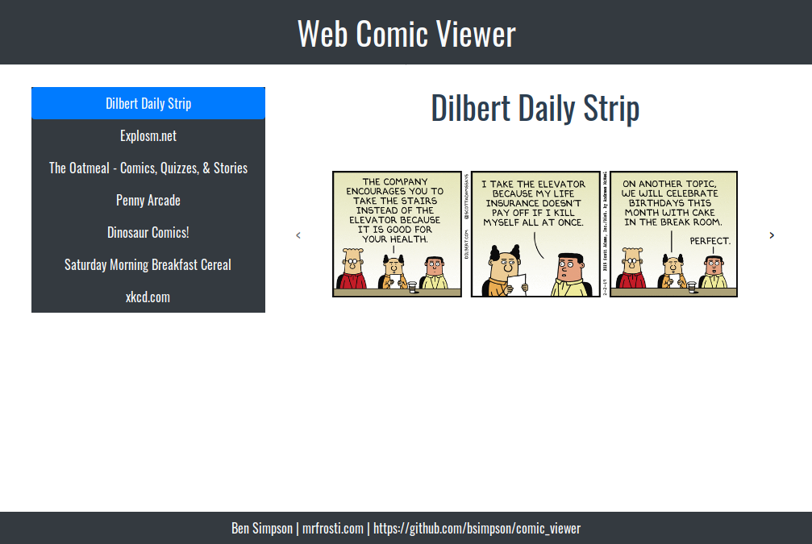

# Comic Viewer

Turn web comics up to 11!

I got tired of RSS feeds that just linked out to the comic.
Its 2019 - I'm a Javascript developer - this is something I can fix.

## Overview



Comics are listed in a menu on the left, and shown on the right.

## Architecture

### Front end

Uses the Vue.js framework with the following components:

* `App.vue` - layout and data fetching
* `Comic.vue` - shows comic preview and listens for keycodes
* `Sidebar.vue` - shows list of comics

Styles are in Bootstrap v4

### Back end

Express.js exposes and caches a route:

`/comics.json` - returns list of comics in expected format

```js
{
  comic: {
    title: 'Comic title',
    description: 'Comic description',
    items: [
      {
        content: 'What to preview',
      }
    ]
  },
}
```
Helper functions provide the heavy lifting:

* Cheerio for DOM parsing
* Axios for network requests

## Keyboard shortcuts

Keyboard shortcuts for navigation are supported:
* `⬅` - Navigate to previous comic
* `➡` - Navigate to next comic

## Adding New Comics

Inside the `server/adapters/` directory lives a file per comic.
There is also the `manifest.js` which loads in all comics.

The adapter interface must expose an async `load()` function. e.g.

```js
module.exports = {
  load: () => utils.parseFeed(URL),
};
```

This is added to the `manifest.js`:

```js
const xkcd = require('./xkcd');

return {
    xkcd: await xkcd.load().catch(console.err),
}
```

This is read and cached by the Express route:

```js
cache.put('urls', await urls(), 3600 * 1000);
```

## Caching

The server will cache all comics for 1 hour

## Contributing

Contribute by opening a PR or an issue on Github.

## License

MIT License

Copyright (c) 2018 Ben Simpson

Permission is hereby granted, free of charge, to any person obtaining a copy of this software and associated documentation files (the "Software"), to deal in the Software without restriction, including without limitation the rights to use, copy, modify, merge, publish, distribute, sublicense, and/or sell copies of the Software, and to permit persons to whom the Software is furnished to do so, subject to the following conditions:

The above copyright notice and this permission notice shall be included in all copies or substantial portions of the Software.

THE SOFTWARE IS PROVIDED "AS IS", WITHOUT WARRANTY OF ANY KIND, EXPRESS OR IMPLIED, INCLUDING BUT NOT LIMITED TO THE WARRANTIES OF MERCHANTABILITY, FITNESS FOR A PARTICULAR PURPOSE AND NONINFRINGEMENT. IN NO EVENT SHALL THE AUTHORS OR COPYRIGHT HOLDERS BE LIABLE FOR ANY CLAIM, DAMAGES OR OTHER LIABILITY, WHETHER IN AN ACTION OF CONTRACT, TORT OR OTHERWISE, ARISING FROM, OUT OF OR IN CONNECTION WITH THE SOFTWARE OR THE USE OR OTHER DEALINGS IN THE SOFTWARE.